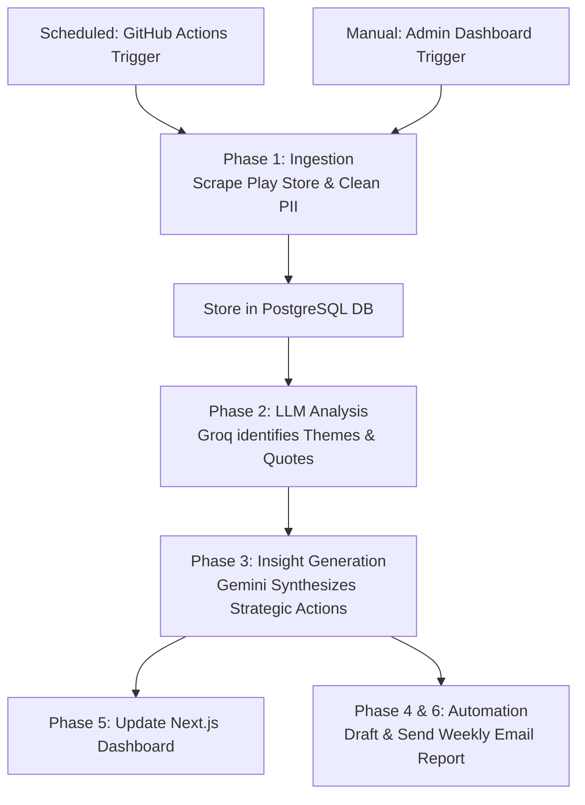

# INDmoney Review Intelligence System 📊

An automated, end-to-end intelligence pipeline designed to scrape Google Play Store reviews for the INDmoney app, analyze user sentiment using AI (Groq & Gemini Llama 3 models), and deliver a comprehensive "Weekly Pulse" report via email and a live executive dashboard.

## 🌟 Key Features

- **Automated Ingestion**: Scrapes up to 500 recent reviews (last 8-12 weeks) from the Google Play Store.
- **Privacy First**: Strict multi-layer PII (Personally Identifiable Information) redaction using Regex filters and AI guardrails to protect user privacy (No names, emails, or phone numbers).
- **AI-Driven Insights**: Uses Groq LLMs to dynamically discover 3-5 core themes and extract the most impactful "Real User Quotes".
- **Strategic Synthesis**: Uses Google Gemini to generate 3 actionable, strategic recommendations based on the weekly feedback.
- **Executive Dashboard**: A beautiful, responsive Next.js frontend (hosted on Vercel) connected to a FastAPI backend (hosted on Railway) backed by a PostgreSQL database.
- **Automated Delivery**: Scheduled via GitHub Actions to automatically run the full pipeline and email the report every Tuesday at 3:50 PM IST.

---

## 🏗️ System Flow

The system operates in a sequential, 6-phase pipeline:

---

## ⚙️ How to Re-Run for Next Week

The system is designed to run completely autonomously. However, if you need to manually trigger the pipeline for the upcoming week, you have two options:

### Option 1: Via the Live Dashboard (Recommended)
1. Navigate to your live Vercel dashboard: `https://indmoney-review.vercel.app/`
2. Scroll to the **Control Center** / **Admin** section.
3. Click **"Run Full Analysis"**. This will trigger the Railway backend to scrape new reviews, analyze them, and update the display.
4. Click **"Email Weekly Report"** to dispatch the summary to the configured email address.

### Option 2: Via GitHub Actions
1. Go to your GitHub Repository -> **Actions** tab.
2. Select the **Weekly Review Audit** workflow from the left sidebar.
3. Click the **Run workflow** dropdown and select the `main` branch.
4. Click **Run workflow**. This will execute the entire ingestion, analysis, and email delivery sequence.

---

## 🎨 Theme Legend

The AI dynamically categorizes reviews into recurring themes. Common themes include (but are not limited to):

- 🔴 **Technical problems and errors**: Bugs, crashes, login issues, app slowness.
- 🟠 **Inconsistent features and functionality**: Broken UI flows, features not working as expected.
- 🟡 **Lack of transparency and communication**: Unclear fees, confusing terms, poor status updates on transactions.
- 🔵 **Poor customer support**: Unresponsive helpdesk, unhelpful ticket resolutions, missing callbacks.
- 🟢 **Positive Feedback**: Praise for UI, useful features, successful US stock investments.

---

## 📄 Latest One-Page Weekly Note (Preview)

Below is an example of the automatically generated comprehensive text note from the latest pipeline run:

***

# INDmoney Weekly Pulse ⚡
**Generated on**: 2026-03-13
**Reviews Analyzed**: 461

### 🔝 Top 3 Feedback Themes
1. **Technical problems and errors** (15 reviews)
2. **Inconsistent features and functionality** (10 reviews)
3. **Lack of transparency and communication** (7 reviews)

### 💬 Voice of the User
> ⭐
> "I was having 38k rupee in wallet and i was earning 5 to 7k fno profit but due to app outage was unable to book profit i tried multiple time but it was not happened and price goes down & 18k loss got. also customer suppot is not call back even if i raised hell lot of tickets for the same... I have video recording as well as screen shot."

> ⭐
> "Terrible service! It's been over a week since I requested a deposit for US stocks trading, and they're clueless about the status. Getting in touch is a nightmare. Wouldn't recommend them to anyone . They never return calls..."

> ⭐⭐⭐⭐⭐
> "Best app I have ever used. It is an another level broker because it contains indan and US stocks which are really helpful. We can buy US stocks from India and its indicator are so helpful... the add money and withdraw is so easy."

### 🚀 AI-Generated Strategic Actions
- **Prioritize fixing 'Technical problems and errors'** and 'Inconsistent features and functionality' as these represent the most concrete and actionable user pain points impacting core app performance and reliability.
- **Address 'Lack of transparency' and 'Poor customer support'** by implementing proactive communication strategies for updates, outages, and support resolutions, potentially through in-app notifications and improved support workflows.
- **Investigate the 'Other' category** to identify emerging trends, unmet needs, or potential new feature requests that could drive significant user engagement and competitive advantage.

***

## 📧 Email Delivery

The system automatically parses the Markdown report above into a clean, professional HTML email delivered to your configured inbox. You will receive this summary every Tuesday afternoon, keeping you constantly informed about user sentiment without needing to manually check dashboards.

---
*Built for Automated AI Intelligence Operations.*
