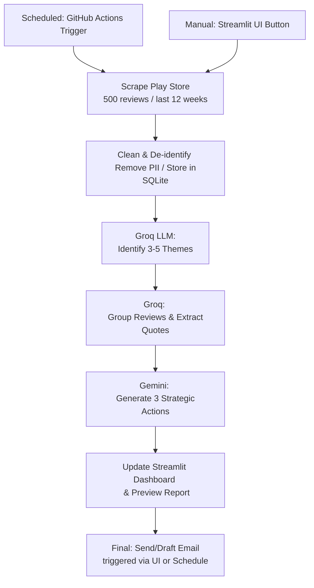

# INDmoney Review Analysis: Weekly Pulse Architecture

## Project Overview
Automated system to analyze Play Store reviews for **INDmoney**, extract themes using **Groq**, and generate a strategic "Pulse" report using **Google Gemini**, delivered via email.

---

## 🏗 Tech Stack
- **Language**: Python 3.9+
- **LLM Engine**: 
  - Phase 2: [Groq API](https://groq.com/) (Llama-3.1-8b-instant)
  - Phase 3: [Google Gemini API](https://ai.google.dev/) (Gemini 2.5 Flash Lite)
- **Data Scraping**: `google-play-scraper`
- **Data Handling**: `pandas`, `sqlite3`
- **Email Delivery**: `smtplib` / `yagmail`
- **Orchestration**: GitHub Actions (Schedule: Weekly)

---

## 🛠 Phase-Wise Architecture

### Phase 1: Data Acquisition & Privacy (Ingestion)
- **Source**: Google Play Store.
- **Constraints**: 
  - Max 500 reviews per run.
  - Filter by date (last 8-12 weeks).
  - **Quality Filters**: 
    - English language only.
    - Minimum length: 6 words.
    - Removal of emoji-only or non-substantive reviews.
- **PII Handling**: 
  - Explicitly discard `userName` and `userImage`.
  - Store only: `score` (rating), `content`, `at` (date), `thumbsUpCount` (helpfulness).
- **Storage**: Lightweight SQLite database (`reviews.db`) to track historical data and prevent duplicates.

### Phase 2: LLM Integration (Groq Engine)
- **Token Management**: Batch review processing to fit LLM context limits.
- **Theme Discovery (Dynamic)**: 
  - Step 1: Input a semantic subset of reviews to Groq.
  - Step 2: Request 3-5 high-level themes (e.g., "UI/UX", "Payment Failures", "Feature Requests").
- **Categorization & Pulse**: 
  - Group all imported reviews into these themes.
  - Extract the top 3 most impactful "real user quotes" across all reviews.

### Phase 3: Insight Generation (The "Pulse")
- **Prompt Engineering**: Instruct LLM to generate:
  - **Top 3 Themes**: Based on volume and sentiment.
  - **3 User Quotes**: Authentic, representative feedback.
  - **3 Action Ideas**: Strategic suggestions (Product, Support, Leadership focus).
- **Output Format**: Markdown / One-page HTML executive summary.

### Phase 4: Delivery (Email Service)
- **Drafting**: Create a draft email with the generated weekly note.
- **Recipients**: Self/Alias (Configurable via environment variables).
- **Content**: Professional layout containing the "One-Page Weekly Pulse".

### Phase 5: Web UI (Executive Dashboard)
- **Frontend Framework**: [Next.js](https://nextjs.org/) (React, TypeScript, Tailwind CSS).
- **Backend Framework**: [FastAPI](https://fastapi.tiangolo.com/) (Python).
- **Features**:
  - **The Pulse Overview**: Beautiful, premium layout displaying aggregated ratings and sentiment trends.
  - **Thematic Breakdown**: Visual charts (Bar/Pie) showing the 3-5 themes identified by Groq.
  - **Live Review Explorer**: Searchable and filterable table of the 500 reviews.
  - **Control Center**: 
    - **"Trigger Analysis"**: Run Phase 2 & 3 via API.
    - **"Send Weekly Note"**: Trigger Phase 4 email dispatch.

### Phase 6: Scheduler & Automation
- **Orchestrator**: Handled by a dedicated Python script (`orchestrator.py`) and backed up by GitHub Actions.
- **Schedule**: Every Tuesday at **3:50 PM IST** (to ensure delivery by 3:55 PM).
- **Process**: Automatic sequential execution of Phase 1 through Phase 4.
- **Cloud Execution**: GitHub Actions workflow (`weekly_audit.yml`) triggers on the same schedule for 100% reliability.
  - **Fixed Recipient**: `stumpmikecricket6@gmail.com`.
  - **Status Logging**: Each step logs completion to ensure the chain isn't broken.

---

## 📈 System Workflow (Weekly)

---

## 🔒 Security & Constraints
- **PII Protection**: Names/Profile photos strictly omitted from the database.
- **API Keys**: Managed via `.env` (Groq & Gemini keys required).
- **Email Delivery Constraints**: Railway blocks outbound SMTP (ports 25, 465, 587) on free plans. Manual frontend email triggers use the **Resend API** (Requires `RESEND_API_KEY`). The automated GitHub Action uses standard Gmail SMTP.
- **Rate Limiting**: Groq TPM/TPD and Gemini limits managed via batching and delays.

---

## 🚀 Execution Plan (Status)
1. **DONE**: Setup environment and API keys (Groq + Gemini).
2. **DONE**: Implement Phase 1 Scraper & SQLite Storage.
3. **DONE**: Develop Phase 2 LLM Analysis (Groq).
4. **DONE**: Build Phase 3 Report Generator (Gemini).
5. **DONE**: Implement Phase 4 & 5 (Premium Dashboard with Email UI).
6. **IN-PROGRESS**: Phase 6 Scheduler for 3:50 PM IST delivery.
